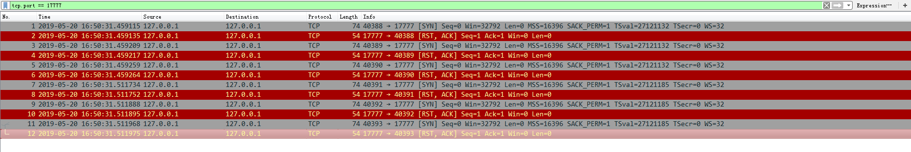
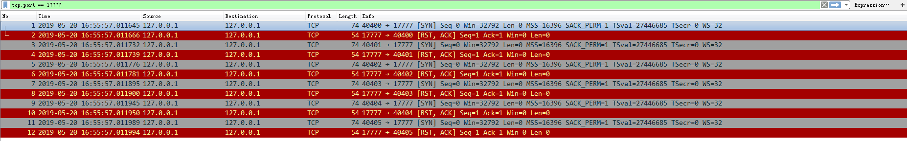
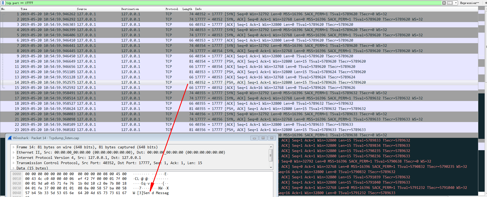
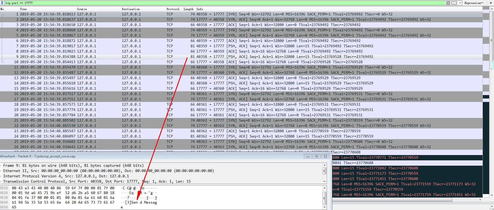
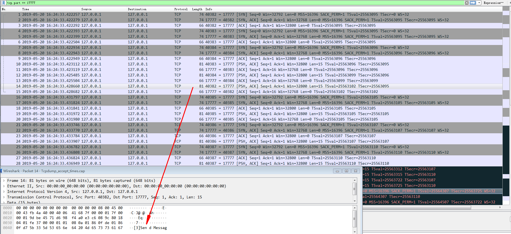

* [由Linux中listen()函数谈开去](#Title)
* [一、简介](#Brief)
    * [1.前言](#Introduction) 
    * [2.问题引入](#Origin) 

* [ 二、原理介绍](#Principle)
    * [1. Tcp三次握手](#Tcp_Three_wayhandshake) 
    * [2. 关于backlog参数的理解](#Backlog_param) 

* [三、实验与分析](#Practice)
    * [1. 实验环境](#Enviroment) 
    * [2. 例程介绍](#SourceCode) 
    * [3. 分步实验](#Experiment) 
        * [1. Server阻塞于socket()创建后](#Pending_on_socket) 
        * [2. Server阻塞于bind()创建后](#Pending_on_bind) 
        * [3. Server阻塞于listen()后](#Pending_on_listen) 
        * [4. Server阻塞于accept()一次后](#Pending_on_accept_once) 
        * [5. Server阻塞于accept()多次](#Pending_on_accept_times) 
    * [4. 实验结果分析](#Summary) 
* [四、参考与链接](#ReferenceAndLinks)
* [五、文档信息](#Info)

<h1 id="Title">由Linux中listen()函数谈开去</h1>  


<h2 id="Brief">一、简介</h2>  
<h3 id="Introduction">1. 前言</h3>  

&emsp;&emsp;本篇博文主要谈一谈Linux系统中，在使用socket套接字建立Tcp连接时，关于listen()函数的backlog参数的理解，同时，借由该问题，并结合具体的实践，尝试厘清Tcp连接的建立过程。
&emsp;&emsp;本篇博客编写主要参考借鉴了以下两篇博文，并在其基础上，加入了个人的一些思考与探索。

1. [深入探索 Linux listen() 函数 backlog 的含义][] 

2. [How TCP backlog works in Linux][]  

&emsp;&emsp;下述内容的讨论，建立在对Tcp/Ip、socket有一定了解的基础上，相关的知识点，可以参考以下博文：

1.[揭开Socket编程的面纱](https://www.cnblogs.com/goodcandle/archive/2005/12/10/socket.html "揭开Socket编程的面纱")  
2.[Linux Socket编程（不限Linux）](https://www.cnblogs.com/skynet/archive/2010/12/12/1903949.html "Linux Socket编程（不限Linux）")


<h3 id="Origin">2. 问题引入</h3>  

&emsp;&emsp;当我们尝试在`Linux`上通过`Socket`建立一个服务器，并接收客户端的连接请求时，服务器端程序通常需要执行以下流程：  
1. 使用创建 [socket()][] 创建一个监听描述符`ListenFd`
2. 使用 [bind()][] 为`ListenFd`绑定一个本地的地址，以便于其它的`socket`（套接字），能够与其建立连接
3. 使用 [listen()][] 将`ListenFd`设置为被动模式——表明自己乐意接受连接请求，并设置【连接建立队列的限制】。
4. 调用 [accept()][] 以接收具体的连接。 
5. 数据交互。。。

&emsp;&emsp;服务器与客户端通过调用相关函数建立连接的流程如下所示：


<html > 
<style> 
.divcss5 {text-align:center} 
</style> 
<div class="divcss5"></div>
<div style="text-align:center">图1：Tcp连接实现</div> 
<span id="Connect.svg"></span>

</html>   


*注：在上图中，并未展示断开连接的过程*


&emsp;&emsp;在平时的工程实践中，自己也都是[照猫画虎][], 知其然而不知其所以然。由于最近尝试写一个[使用TCP构建的客户端/服务器公共框架][]的框架，在写作过程中，发现自己对于很多基础的操作都不明其意，基于此，才有了这边博文。
&emsp;&emsp;文章首先介绍socket的一些基本概念，接下来通过一个具体的实例，并结合相应的抓包分析，印证实际与理论是否相符。

<h2 id="Principle">二、原理介绍</h2>  

<h3 id="Tcp_Three_wayhandshake">1. Tcp三次握手</h3>  

&emsp;&emsp;在学习计算机网络的相关知识时，想必大家对于Tcp三次握手的连接过程并不陌生： 

<html > 
<style> 
.divcss5 {text-align:center} 
</style> 
<div class="divcss5"></div>
<div style="text-align:center">图2: Tcp三次握手</div> 
</html>   

&emsp;&emsp;正如上图所示： 
1. 客户端请求建立连接，然后进入 ==SYN-SENT== 状态
2. 处于==LISTEN==状态的服务器端在收到连接请求后，给客户端回复应答，同时进入==SYN-RCVD==状态
3. 客户端在收到应答后，进入==ESTABLISHED==状态，同时再次发消息告知服务器端
4. 服务器端在收到消息后，亦即进入==ESTABLISHED==状态  

&emsp;&emsp;在完成上述交互过程后，Tcp 连接建立，两者即可进行后续的数据交互。
&emsp;&emsp;以上为建立连接的逻辑过程，看起来清晰易懂，似乎没有什么难以理解的地方，但是，倘若需要我们将三次握手过程与[图一](#Connect.svg)的实现联系起来呢？
&emsp;&emsp;根据自己以往的经验，具体的实现，与Tcp三次握手的原理图，应该是如下的对应关系：
<html > 
<span id="IncorrectUnderstand.svg"></span>
<style> 
.divcss5 {text-align:center} 
</style> 
<div class="divcss5"></div>
<div style="text-align:center">图3: Tcp三次握手实现的错误理解</div> 

</html>  

&emsp;&emsp;对于客户端而言：在调用`connect()`后进入==SYN-SENT==状态，同时阻塞，以等待服务器应答；在接收到应答后，则进入==ESTABLISHED==状态。  
*注：调用`socket()`到`connect()`之间的这段状态，我们暂且将其称为`INIT`状态*
&emsp;&emsp;对于服务器而言：调用`listen()`后进入==LISTEN==状态，在调用`accept()`接收客户端的连接请求后，会短暂的进入==SYN-RCVD==状态，随后进入==ESTABLISHED==状态。  
*注：调用`socket()`到`listen()`之间的这段状态，我们暂且将其称为`INIT`状态*
&emsp;&emsp;图中的状态划分，粗看的话，似乎也说的过去，完整体现了三次握手的过程，但事实是否真的如此呢？在展开具体的说明之前，首先需要对`listen()`函数进行介绍。
<h3 id="Backlog_param">2. 关于backlog参数的理解</h3>  
```cpp
int listen(int sockfd, int backlog);
```
&emsp;&emsp;`listen()`将`sockfd`对应的描述符标记为被动模式，所谓被动模式的意思也就是说，可以用`accept()`来接受收到的连接请求。其中，`backlog`参数指定列了挂起连接队列可以增长的最大长度。
&emsp;&emsp;正如上文所说的，由于Tcp通过三次握手建立连接，一个连接在成功建立并进入==ESTABLISHED==状态前，会经历一段短暂的==SYN-RCVD==状态，之后就可以被`accept()`系统调用处理，并返回给应用。这意味着Tcp/Ip协议栈拥有两种方式来实现处于==LISTEN==状态的socket套接字的`backlog`队列：
- 方式1  
>&emsp;&emsp;The implementation uses a single queue, the size of which is determined by the backlog argument of the listen syscall. When a SYN packet is received, it sends back a SYN/ACK packet and adds the connection to the queue. When the corresponding ACK is received, the connection changes its state to ESTABLISHED and becomes eligible for handover to the application. This means that the queue can contain connections in two different state: SYN RECEIVED and ESTABLISHED. Only connections in the latter state can be returned to the application by the accept syscall.  
——《[How TCP backlog works in Linux][]》  

&emsp;&emsp;实现使用单个队列，其尺寸由`listen()`的`backlog`参数决定。处于被动模式的`socket`在收到一个`SYN`报文后，它返回一个` SYN/ACK`报文，并将该链接加入队列。在收到相应的`ACK`应答报文后，此连接将状态改为==ESTABLISHED==，此后，才有资格被移交给应用程序（*注：才可以用于后续的交互*）。以上也就意味着，该队列可能同时包含处于==SYN-RCVD==以及==ESTABLISHED==两种状态的连接。只有处于后一种状态的连接，方可以被`accept()`处理，并返回给用户。  

- 方式2  
<span id="Way2"></span>
>&emsp;&emsp;The implementation uses two queues, a SYN queue (or incomplete connection queue) and an accept queue (or complete connection queue). Connections in state SYN RECEIVED are added to the SYN queue and later moved to the accept queue when their state changes to ESTABLISHED, i.e. when the ACK packet in the 3-way handshake is received. As the name implies, the accept call is then implemented simply to consume connections from the accept queue. In this case, the backlog argument of the listen syscall determines the size of the accept queue.  
——《[How TCP backlog works in Linux][]》  

&emsp;&emsp;此种实现使用两个队列：`SYN`队列(连接未完成队列)，以及`accept`队列（已完成连接的队列）。==SYN-RCVD==状态的连接被加入`SYN`队列，当连接状态变为==ESTABLISHED==后，则被移入到`accept`队列（例如，在接收到三次握手中的`ACK`报文时）。顾名思义,`accept()`调用，其实现就是为了接受来自`accept`队列的连接（*注：所谓接受连接，意即该连接已经建立，可以通过调用`accept()`被返回给用户,并用于后续交互。随后，该连接也就被从`accept`队列中移除*）。对于此种方式，`listen()`调用的`backlog`参数，决定了`accept`队列的大小。

>&emsp;&emsp;Historically, BSD derived TCP implementations use the first approach. That choice implies that when the maximum backlog is reached, the system will no longer send back SYN/ACK packets in response to SYN packets. Usually the TCP implementation will simply drop the SYN packet (instead of responding with a RST packet) so that the client will retry.  
&emsp;&emsp;The BSD implementation does use two separate queues, but they behave as a single queue with a fixed maximum size determined by (but not necessary exactly equal to) the backlog argument：
>>The queue limit applies to the sum of […] the number of entries on the incomplete connection queue […] and […] the number of entries on the completed connection queue […].
>
>——《[How TCP backlog works in Linux][]》  


&emsp;&emsp;从历史上看，派生自BSD的Tcp实现使用第一种方案。该选择意味着，当队列达到`backlog`所定义的最大值时，系统不会发送`SYN/ACK`报文去回应`SYN`报文。通常，Tcp实现只会丢弃`SYN`报文（而不是应答`RST`报文），以便客户端可以重试。
&emsp;&emsp;BSD实现确实是用两个队列，然而它们的行为就如同是由`backlog`参数决定大小的单个队列。
&emsp;&emsp;队列限制适用于未完成连接队列的条目数与已完成连接条目数的总和。
  

>On Linux, things are different, as mentioned in the man page of the listen syscall:
>>The behavior of the backlog argument on TCP sockets changed with Linux 2.2. Now it specifies the queue length for completely established sockets waiting to be accepted, instead of the number of incomplete connection requests. The maximum length of the queue for incomplete sockets can be set using /proc/sys/net/ipv4/tcp_max_syn_backlog.
>
>——《[How TCP backlog works in Linux][]》  

&emsp;&emsp;在Linux上，情况则有所不同，以下是`man page`中关于`listen`系统调用的内容：
&emsp;&emsp;Tcp socket的`backlog`参数的行为在Linux2.2中有所改变。它现在指定了等待被接受的连接已完成的套接字的队列（*注：即`accept`队列*）的长度，而不是未完成的连接请求的个数（*注：即`SYN`队列中所包含的连接个数*）。 未完成连接队列的最大长度可以被设定为`/proc/sys/net/ipv4/tcp_max_syn_backlog`。
&emsp;&emsp;为了验证实际是否与上述理论是一致的，我们将在下文中通过具体的例程，并结合具体的抓包数据，对Tcp的连接过程进行分析。


<h2 id="Practice">三、实验与分析</h2>

<h3 id="Enviroment">1. 实验环境</h3> 

  处理器名称：Intel(R) Core(TM) i3-4170 CPU @ 3.70GHz  
  系统版本：CentOS release 6.5 (Final)
  编译器版本：gcc version 4.4.7 20120313

<h3 id="SourceCode">2. 例程介绍</h3>   

&emsp;&emsp;实验使用的例程包括`Client`与`Server`两部分，[具体地址详见](./Example)。
- 客户端代码片段
```cpp
#include<stdio.h>
#include<sys/types.h>
#include<sys/socket.h>
#include<netinet/in.h>
#include<arpa/inet.h>
#include<string.h>
#include<strings.h>
#include<stdlib.h>
#include<unistd.h>
#include<pthread.h>
#include <stdarg.h>
#include <sys/errno.h>
#include <iostream>
#include <sstream>

#define PORT 17777
#define THREAD_NUM 6  //定义创建的线程数量
#define MAXLINE 1024
struct sockaddr_in stServAddr;
using namespace std;
/**
*@brief 格式化错误信息
*
*
*@param int errnoflag
*@param int error
*@param const char *fmt
*@param va_list ap
*
*@return
* 
*
*@author Litost_Cheng
*@date 2019年1月21日
*@note 新生成函数
*/
static void ErrDoit(int errnoflag, int error, const char *fmt, va_list ap)
{
	char	buf[MAXLINE];

	vsnprintf(buf, MAXLINE-1, fmt, ap);
	if (errnoflag)
		snprintf(buf + strlen(buf), MAXLINE - strlen(buf) - 1, ": errno[%d] %s",
				 error, strerror(error));
	strcat(buf, "\n");
	fflush(stdout);		/* in case stdout and stderr are the same */
	fputs(buf, stderr);
	fflush(NULL);		/* flushes all stdio output streams */
}

/**
*@brief 判断条件，打印errno并退出
*
*
*@param bool bCondition
*@param const char *fmt
*@param ...
*
*@return 
* 
*
*@author Litost_Cheng
*@date 2019年5月11日
*@note 新生成函数
*
*/
bool CondJudgeExit(bool bCondition, const char *fmt, ...)
{
    if (!bCondition)
    {
		va_list 	ap;
		va_start(ap, fmt);
		ErrDoit(1, errno, fmt, ap);
		va_end(ap);
		exit(1);
    }
    return bCondition;
}

void *func(void *) 
{
    int nConnFd;
    nConnFd = socket(AF_INET,SOCK_STREAM,0);
    printf("nConnFd : %d\n",nConnFd);

    ///在没个子线程中，都会尝试与服务器连接连接，并返回结果
    if ((connect(nConnFd,(struct sockaddr *)&stServAddr,sizeof(struct sockaddr_in)) == -1))
    {
        printf("[nConnFd] Connect failed: [%s]\n", strerror(errno));
        return (void *)-1;
    }
    else
    {
	    printf("Connect succeed!\n");
        stringstream strStream;
        strStream << "[" << nConnFd << "]" << "Send Message"; 
        printf("strStream is [%s]\n", strStream.str().c_str());
        if (-1 == write(nConnFd, strStream.str().c_str(), strStream.str().size()))
        {
            printf("[nConnFd] Connect failed: [%s]\n", strerror(errno));
            return (void *)-1;
        }
        else
        {
            printf("[nConnFd] Send succeed!\n", nConnFd);
        }
        

    }

    while(1) {}
}

int main(int argc,char *argv[])
{

    memset(&stServAddr,0,sizeof(struct sockaddr_in));
    stServAddr.sin_family = AF_INET;
    stServAddr.sin_port = htons(PORT);
    inet_aton("127.0.0.1",(struct in_addr *)&stServAddr.sin_addr); 

    //创建线程并且等待线程完成
    pthread_t nPid[THREAD_NUM];
	//system("netstat -atn | grep '17777'");
	//printf("netstat -atn\n");
    for(int i = 0 ; i < THREAD_NUM; ++i)
    {
        pthread_create(&nPid[i],NULL,&func,NULL);

    }


	sleep(3);
	//system("netstat -atn | grep '17777'");
	//printf("netstat -atn\n");
    for(int i = 0 ; i < THREAD_NUM; ++i)
    {
        pthread_join(nPid[i], NULL);
    }

    return 0;
}

```
&emsp;&emsp;以上，为了搞清`backlog`参数的真实含义，客户端进程会创建`THREAD_NUM`个线程，来向服务器端发起连接请求，并返回相应的结果。
- 服务器端代码片段
```cpp
#include<stdio.h>
#include<sys/types.h>
#include<sys/socket.h>
#include<sys/time.h>
#include<netinet/in.h>
#include<arpa/inet.h>
#include<errno.h>
#include<stdlib.h>
#include<string.h>
#include<unistd.h>
#include <string>
#include <stdarg.h>
#include <sys/errno.h>
#include <iostream>
#define PORT  17777    //端口号
#define BACKLOG 2     //BACKLOG大小
#define MAXLINE 1024


using namespace std;
/**
*@brief 格式化错误信息
*
*
*@param int errnoflag
*@param int error
*@param const char *fmt
*@param va_list ap
*
*@return
* 
*
*@author Litost_Cheng
*@date 2019年1月21日
*@note 新生成函数
*/
static void ErrDoit(int errnoflag, int error, const char *fmt, va_list ap)
{
	char	buf[MAXLINE];

	vsnprintf(buf, MAXLINE-1, fmt, ap);
	if (errnoflag)
		snprintf(buf + strlen(buf), MAXLINE - strlen(buf) - 1, ": errno[%d] %s",
				 error, strerror(error));
	strcat(buf, "\n");
	fflush(stdout);		/* in case stdout and stderr are the same */
	fputs(buf, stderr);
	fflush(NULL);		/* flushes all stdio output streams */
}

/**
*@brief 判断条件，打印errno并退出
*
*
*@param bool bCondition
*@param const char *fmt
*@param ...
*
*@return 
* 
*
*@author Litost_Cheng
*@date 2019年5月11日
*@note 新生成函数
*
*/
bool CondJudgeExit(bool bCondition, const char *fmt, ...)
{
    if (!bCondition)
    {
		va_list 	ap;
		va_start(ap, fmt);
		ErrDoit(1, errno, fmt, ap);
		va_end(ap);
		exit(1);
    }
    return bCondition;
}

/**
*@brief 展示连接信息
*
*
*@param bool bCondition
*@param const char *fmt
*@param ...
*
*@return void
* 
*
*@author Litost_Cheng
*@date 2019年5月11日
*@note 新生成函数
*
*/
void Display()
{
	system("netstat -atn | grep '17777' | sort -n -t : -k 2");

	printf("netstat -atn | grep '17777' | sort -n -t : -k 2\n");

	//system("lsof -nP -iTCP | grep '17777'");
	//printf("lsof -nP -iTCP | grep '17777'\n");

}

char *pCmd[5];
int main(int argc,char *argv[])
{
    int nConLen;
    int nSockFd,nConnFd;
    struct sockaddr_in stServAddr,stConnAddr;
	int nCmd = 0;
	pCmd[0] = "socket";
	pCmd[1] = "bind";
	pCmd[2] = "listen";
	pCmd[3] = "accept_once";
	pCmd[4] = "accept_times";
	
	printf("Please input the Cmd: \n");
	for(int n=0; n<5; n++)
	{
		printf("\t[%d]: [%s]\n", n, pCmd[n]);
	}
	
	std::cin >> nCmd;

	std::string strSysCmd =  "tcpdump -i lo -s 0 -w ./Tcpdump_";
	strSysCmd += pCmd[nCmd];
	strSysCmd += ".cap";
	strSysCmd += " &";
	system(strSysCmd.c_str());
	printf("[%s]\n", strSysCmd.c_str());
	do
	{
		printf("Start:");
		Display();
		//创建套接字
		CondJudgeExit(((nSockFd = socket(AF_INET,SOCK_STREAM,0)) != -1), "Create socket failed!\n");
		if (0 == nCmd)
		{
			break;
		}
		
		//为套接字绑定地址，需要注意字节序
		memset(&stServAddr,0,sizeof(struct sockaddr_in));
		stServAddr.sin_family = AF_INET;
		stServAddr.sin_port = htons(PORT);
		stServAddr.sin_addr.s_addr = htonl(INADDR_ANY);
		
		CondJudgeExit((bind(nSockFd,(struct sockaddr *)&stServAddr,sizeof(struct sockaddr_in)) != -1), "bind failed!\n");
		if (1 == nCmd)
		{
			break;
		}
		
		//设置为被动模式	
		CondJudgeExit((listen(nSockFd,BACKLOG) != -1), "listen filed!\n");
		if (2 == nCmd)
		{
			break;
		}	

		//accept once
		nConLen = sizeof(struct sockaddr_in);
		//sleep(10);                  //sleep 10s之后接受一个连接


		//该套接字默认为阻塞模式，所以，倘若没有接受的一个成功建立的连接，则会一直阻塞在这里
		accept(nSockFd,(struct sockaddr *)&stConnAddr,(socklen_t *)&nConLen);
		
		printf("I have accept one Connect: [%s], port[%d] \n", inet_ntoa(stConnAddr.sin_addr), ntohs(stConnAddr.sin_port));
		

		
		
		if (3 == nCmd)
		{
			break;
		}

		printf("Pending on [%s]\n", pCmd[nCmd]);
		while(1)
		{
			sleep(3);                  //周期性接受连接请求
			printf("I will accept one\n");
			accept(nSockFd,(struct sockaddr *)&stConnAddr,(socklen_t *)&nConLen);
			printf("I have accept one Connect: [%s], port[%d] \n", inet_ntoa(stConnAddr.sin_addr), ntohs(stConnAddr.sin_port));

			Display();
		}		
		
	}
	while(0);
	while(1)
	{
		printf("Pending on [%s]\n", pCmd[nCmd]);
		Display();
		sleep(1);
	}

    return 0;
}
```
&emsp;&emsp;对于服务器端进程而言，我们手动将`backlog`设置为`BACKLOG`，以判断其如何处理过量的连接；此外，为了厘清Tcp三次握手与具体实现之间的联系，该例程会根据用户输入的不同的选项，将程序阻塞在不同阶段，并结合对应时刻的连接状态以及抓包数据，确定当前连接所处的状态。
&emsp;&emsp;在开始具体的实验前，有以下几点是需要我们注意的：
1. 为了理解`backlog`参数的实际含义，实验过程中，我们要求`Client`程序中的`THREAD_NUM`参数应该要大于`Server`中的`BACKLOG`,以认为造成过量的连接请求。
2. 代码的编译使用自动的`makefile`文件模板[MakeFileTemplate][],用户只需执行`make`命令，即可生成相应的可执行文件。
3. 连接状态的获取使用[netstat][netstat指令]获取
3. 抓包数据的获取使用Tcpdump,并配合Wireshark工具对抓包进行分析，关于两工具的使用，详见该链接：[聊聊 tcpdump 与 Wireshark 抓包分析][]。


<h3 id="Experiment">3. 分步实验</h3>  

在具体的实验过程中，我们会将`Server`分别阻塞以下几个阶段，同时会附上相应的程序输出（`Client`,`Server`），连接状态，以及抓包数据，以方便读者能够有一个直观的认识。  

<h4 id="Pending_on_socket">1. Server阻塞于socket()创建后</h4>  

- 实验数据  
    1. 客户端输出  
    ```cpp
    [root@litost Client]# ./Client 
    nConnFd : 3
    nConnFd : 4
    nConnFd : 5
    [nConnFd] Connect failed: [Connection refused]
    [nConnFd] Connect failed: [Connection refused]
    [nConnFd] Connect failed: [Connection refused]
    nConnFd : 6
    [nConnFd] Connect failed: [Connection refused]
    nConnFd : 7
    [nConnFd] Connect failed: [Connection refused]
    nConnFd : 8
    [nConnFd] Connect failed: [Connection refused]
    [root@litost Client]#   
    ```
    2.  服务器输出
    ```cpp
    [root@litost Server]# ./Server 
    Please input the Cmd: 
            [0]: [socket]
            [1]: [bind]
            [2]: [listen]
            [3]: [accept_once]
            [4]: [accept_times]
    0
    [tcpdump -i lo -s 0 -w ./Tcpdump_socket.cap &]
    Start:netstat -atn | grep '17777' | sort -n -t : -k 2
    Pending on [socket]
    netstat -atn | grep '17777' | sort -n -t : -k 2
    tcpdump: listening on lo, link-type EN10MB (Ethernet), capture size 65535 bytes
    Pending on [socket]
    netstat -atn | grep '17777' | sort -n -t : -k 2
    ```
    3.  抓包数据
    <html > 
    <style> 
    .divcss5 {text-align:left} 
    </style> 
    <div class="divcss5"></div>
    </html> 

- 数据分析  
&emsp;&emsp;从以上实验数据，我们不难看出，当`Client`尝试去连接阻塞在`socket()`状态的`Server`时，连接全部失败，从抓包获取到的数据来看，针对客户端的`SYN`请求，`Server`直接回复了`RST`，而从`Client`调用`accept()` 返回的错误结果来看，显示连接被拒绝。
&emsp;&emsp;因此在该阶段，`Client`应该是进入了短暂的==SYN-SENT==阶段(*注：并未从`netstat`抓取到有关数据，可能是由于连接迅速被断开导致*)，随后连接即被拒绝,而`Server`则是处于==CLOSED==状态。  

<h4 id="Pending_on_bind">2. Server阻塞于bind()后</h4>  

- 实验数据  
    1. 客户端输出  
    ```cpp
    [root@litost Client]# ./Client 
    nConnFd : 3
    nConnFd : 4
    nConnFd : 5
    [nConnFd] Connect failed: [Connection refused]
    [nConnFd] Connect failed: [Connection refused]
    [nConnFd] Connect failed: [Connection refused]
    nConnFd : 6
    [nConnFd] Connect failed: [Connection refused]
    nConnFd : 7
    [nConnFd] Connect failed: [Connection refused]
    nConnFd : 8
    [nConnFd] Connect failed: [Connection refused]
    [root@litost Client]# 
    ```
    2. 服务器端输出
    ```cpp
    [root@litost Server]# ./Server 
    Please input the Cmd: 
            [0]: [socket]
            [1]: [bind]
            [2]: [listen]
            [3]: [accept_once]
            [4]: [accept_times]
    1
    [tcpdump -i lo -s 0 -w ./Tcpdump_bind.cap &]
    Start:netstat -atn | grep '17777' | sort -n -t : -k 2
    Pending on [bind]
    tcpdump: listening on lo, link-type EN10MB (Ethernet), capture size 65535 bytes
    netstat -atn | grep '17777' | sort -n -t : -k 2
    Pending on [bind]
    netstat -atn | grep '17777' | sort -n -t : -k 2
    ```
    3. 抓包数据
    <html > 
    <style> 
    .divcss5 {text-align:left} 
    </style> 
    <div class="divcss5"></div>
    </html> 
 - 数据分析  
  &emsp;&emsp;在实际的实验过程中，对于`Client`而言，其情况与阻塞在`socket()`时保持一致：连接全部失败。
  &emsp;&emsp;因此在该阶段，`Client`应该也是进入了短暂的==SYN-SENT==阶段(*注：并未从`netstat`抓取到有关数据，可能是由于连接迅速被断开导致*)，随后连接即被拒绝,而`Server`一直处于==CLOSED==状态。   

  <h4 id="Pending_on_listen">3. Server阻塞于listen()后</h4>  

- 实验数据  
    1. 客户端输出  
    ```cpp
    [root@litost Client]# ./Client 
    nConnFd : 3
    nConnFd : 4
    nConnFd : 5
    Connect succeed!
    strStream is [[5]Send Message]
    [nConnFd] Send succeed!
    Connect succeed!
    strStream is [[4]Send Message]
    [nConnFd] Send succeed!
    Connect succeed!
    strStream is [[3]Send Message]
    [nConnFd] Send succeed!
    nConnFd : 6
    Connect succeed!
    strStream is [[6]Send Message]
    [nConnFd] Send succeed!
    nConnFd : 7
    Connect succeed!
    strStream is [[7]Send Message]
    [nConnFd] Send succeed!
    nConnFd : 8
    Connect succeed!
    strStream is [[8]Send Message]
    [nConnFd] Send succeed!
    ^C
    [root@litost Client]# 
    ```
    2. 服务器端输出
    ```cpp
    [root@litost Server]# ./Server 
    Please input the Cmd: 
            [0]: [socket]
            [1]: [bind]
            [2]: [listen]
            [3]: [accept_once]
            [4]: [accept_times]
    2
    [tcpdump -i lo -s 0 -w ./Tcpdump_listen.cap &]
    Start:netstat -atn | grep '17777' | sort -n -t : -k 2
    Pending on [listen]
    tcpdump: listening on lo, link-type EN10MB (Ethernet), capture size 65535 bytes
    tcp        0      0 0.0.0.0:17777               0.0.0.0:*                   LISTEN      
    netstat -atn | grep '17777' | sort -n -t : -k 2
    Pending on [listen]
    tcp        0      0 0.0.0.0:17777               0.0.0.0:*                   LISTEN      
    netstat -atn | grep '17777' | sort -n -t : -k 2
    Pending on [listen]
    tcp        0      0 0.0.0.0:17777               0.0.0.0:*                   LISTEN      
    tcp        0      0 127.0.0.1:17777             127.0.0.1:40355             SYN_RECV    
    tcp        0      0 127.0.0.1:17777             127.0.0.1:40356             SYN_RECV    
    tcp       15      0 127.0.0.1:17777             127.0.0.1:40352             ESTABLISHED 
    tcp       15      0 127.0.0.1:17777             127.0.0.1:40353             ESTABLISHED 
    tcp       15      0 127.0.0.1:17777             127.0.0.1:40354             ESTABLISHED 
    tcp        0      0 127.0.0.1:40352             127.0.0.1:17777             ESTABLISHED 
    tcp        0      0 127.0.0.1:40353             127.0.0.1:17777             ESTABLISHED 
    tcp        0      0 127.0.0.1:40354             127.0.0.1:17777             ESTABLISHED 
    tcp        0     15 127.0.0.1:40355             127.0.0.1:17777             ESTABLISHED 
    tcp        0     15 127.0.0.1:40356             127.0.0.1:17777             ESTABLISHED 
    tcp        0      1 127.0.0.1:40357             127.0.0.1:17777             SYN_SENT    
    netstat -atn | grep '17777' | sort -n -t : -k 2
    Pending on [listen]
    tcp        0      0 0.0.0.0:17777               0.0.0.0:*                   LISTEN      
    tcp        0      0 127.0.0.1:17777             127.0.0.1:40355             SYN_RECV    
    tcp        0      0 127.0.0.1:17777             127.0.0.1:40356             SYN_RECV    
    tcp       15      0 127.0.0.1:17777             127.0.0.1:40352             ESTABLISHED 
    tcp       15      0 127.0.0.1:17777             127.0.0.1:40353             ESTABLISHED 
    tcp       15      0 127.0.0.1:17777             127.0.0.1:40354             ESTABLISHED 
    tcp        0      0 127.0.0.1:40352             127.0.0.1:17777             ESTABLISHED 
    tcp        0      0 127.0.0.1:40353             127.0.0.1:17777             ESTABLISHED 
    tcp        0      0 127.0.0.1:40354             127.0.0.1:17777             ESTABLISHED 
    tcp        0     15 127.0.0.1:40355             127.0.0.1:17777             ESTABLISHED 
    tcp        0     15 127.0.0.1:40356             127.0.0.1:17777             ESTABLISHED 
    tcp        0      1 127.0.0.1:40357             127.0.0.1:17777             SYN_SENT    
    netstat -atn | grep '17777' | sort -n -t : -k 2
    Pending on [listen]
    tcp        0      0 0.0.0.0:17777               0.0.0.0:*                   LISTEN      
    tcp        0      0 127.0.0.1:17777             127.0.0.1:40355             SYN_RECV    
    tcp        0      0 127.0.0.1:17777             127.0.0.1:40356             SYN_RECV    
    tcp        0      0 127.0.0.1:17777             127.0.0.1:40357             SYN_RECV    
    tcp       15      0 127.0.0.1:17777             127.0.0.1:40352             ESTABLISHED 
    tcp       15      0 127.0.0.1:17777             127.0.0.1:40353             ESTABLISHED 
    tcp       15      0 127.0.0.1:17777             127.0.0.1:40354             ESTABLISHED 
    tcp        0      0 127.0.0.1:40352             127.0.0.1:17777             ESTABLISHED 
    tcp        0      0 127.0.0.1:40353             127.0.0.1:17777             ESTABLISHED 
    tcp        0      0 127.0.0.1:40354             127.0.0.1:17777             ESTABLISHED 
    tcp        0     15 127.0.0.1:40355             127.0.0.1:17777             ESTABLISHED 
    tcp        0     15 127.0.0.1:40356             127.0.0.1:17777             ESTABLISHED 
    tcp        0     15 127.0.0.1:40357             127.0.0.1:17777             ESTABLISHED
    ```
    3. 抓包数据
    <html > 
    <style> 
    .divcss5 {text-align:left} 
    </style> 
    <div class="divcss5"></div>
    </html> 
 - 数据分析  
  &emsp;&emsp;在实际的实验过程中，对于`Client`而言，从`connect()`以及`write()`的结果来看，所有的连接都已成功建立，且处于==ESTABLISHED==状态。
  &emsp;&emsp;但是，对于`Server`而言，有三个套接字（端口分别为：`40352`,`40353`,`40354`）处于==ESTABLISHED==状态，剩余的三个则仍处于==SYN_RECV==（但是需要注意的是,我们是将`backlog`的值设置为2）。同时，我们结合具体的抓包数据进行分析：针对所有连接而言，Tcp三次握手过程，都已完成。由此说明，对于处于被动模式的套接字(调用`listen()`后)，能够自动处理接收到的连接请求，并完成三次握手的交互。同时，会将`backlog + 1`数量的连接放置于`accept`队列。
  &emsp;&emsp;因此在该阶段，`Client`都处于==ESTABLISHED==阶段，`Server`则有`backlog + 1`数量的连接处于==ESTABLISHED==，剩余则是处于==SYN_RECV==状态。  

  <h4 id="Pending_on_accept_once">4. Server阻塞于accept()一次后</h4>  

- 实验数据  
    1. 客户端输出  
    ```cpp
    [root@litost Client]# ./Client 
    nConnFd : 3
    nConnFd : 4
    Connect succeed!
    strStream is [[4]Send Message]
    [nConnFd] Send succeed!
    Connect succeed!
    strStream is [[3]Send Message]
    [nConnFd] Send succeed!
    nConnFd : 5
    Connect succeed!
    strStream is [[5]Send Message]
    [nConnFd] Send succeed!
    nConnFd : 6
    Connect succeed!
    strStream is [[6]Send Message]
    [nConnFd] Send succeed!
    nConnFd : 7
    Connect succeed!
    strStream is [[7]Send Message]
    [nConnFd] Send succeed!
    nConnFd : 8
    Connect succeed!
    strStream is [[8]Send Message]
    [nConnFd] Send succeed!
    ^C
    [root@litost Client]# 
    ```
    2. 服务器端输出
    ```cpp
    [root@litost Server]# ./Server 
    Please input the Cmd: 
            [0]: [socket]
            [1]: [bind]
            [2]: [listen]
            [3]: [accept_once]
            [4]: [accept_times]
    3
    [tcpdump -i lo -s 0 -w ./Tcpdump_accept_once.cap &]
    Start:netstat -atn | grep '17777' | sort -n -t : -k 2
    tcpdump: listening on lo, link-type EN10MB (Ethernet), capture size 65535 bytes
    I have accept one Connect: [127.0.0.1], port[42653] 
    Pending on [accept_once]
    tcp        0      0 0.0.0.0:17777               0.0.0.0:*                   LISTEN      
    tcp        0      0 127.0.0.1:17777             127.0.0.1:40362             SYN_RECV    
    tcp        0      0 127.0.0.1:17777             127.0.0.1:40363             SYN_RECV    
    tcp       15      0 127.0.0.1:17777             127.0.0.1:40358             ESTABLISHED 
    tcp       15      0 127.0.0.1:17777             127.0.0.1:40359             ESTABLISHED 
    tcp       15      0 127.0.0.1:17777             127.0.0.1:40360             ESTABLISHED 
    tcp       15      0 127.0.0.1:17777             127.0.0.1:40361             ESTABLISHED 
    tcp        0      0 127.0.0.1:40358             127.0.0.1:17777             ESTABLISHED 
    tcp        0      0 127.0.0.1:40359             127.0.0.1:17777             ESTABLISHED 
    tcp        0      0 127.0.0.1:40360             127.0.0.1:17777             ESTABLISHED 
    tcp        0      0 127.0.0.1:40361             127.0.0.1:17777             ESTABLISHED 
    tcp        0     15 127.0.0.1:40362             127.0.0.1:17777             ESTABLISHED 
    tcp        0     15 127.0.0.1:40363             127.0.0.1:17777             ESTABLISHED 
    netstat -atn | grep '17777' | sort -n -t : -k 2
    Pending on [accept_once]
    tcp        0      0 0.0.0.0:17777               0.0.0.0:*                   LISTEN      
    tcp        0      0 127.0.0.1:17777             127.0.0.1:40362             SYN_RECV    
    tcp        0      0 127.0.0.1:17777             127.0.0.1:40363             SYN_RECV    
    tcp       15      0 127.0.0.1:17777             127.0.0.1:40358             ESTABLISHED 
    tcp       15      0 127.0.0.1:17777             127.0.0.1:40359             ESTABLISHED 
    tcp       15      0 127.0.0.1:17777             127.0.0.1:40360             ESTABLISHED 
    tcp       15      0 127.0.0.1:17777             127.0.0.1:40361             ESTABLISHED 
    tcp        0      0 127.0.0.1:40358             127.0.0.1:17777             ESTABLISHED 
    tcp        0      0 127.0.0.1:40359             127.0.0.1:17777             ESTABLISHED 
    tcp        0      0 127.0.0.1:40360             127.0.0.1:17777             ESTABLISHED 
    tcp        0      0 127.0.0.1:40361             127.0.0.1:17777             ESTABLISHED 
    tcp        0     15 127.0.0.1:40362             127.0.0.1:17777             ESTABLISHED 
    tcp        0     15 127.0.0.1:40363             127.0.0.1:17777             ESTABLISHED 
    ```
    3. 抓包数据
    <html > 
    <style> 
    .divcss5 {text-align:left} 
    </style> 
    <div class="divcss5"></div>
    </html> 
 - 数据分析  
  &emsp;&emsp;在实际的实验过程中，对于`Client`而言，其状态与阻塞在`listen()`时，保持一致，为==ESTABLISHED==状态。
  &emsp;&emsp;但是，对于`Server`而言，相比于阻塞在`listen()`时，有四个套接字（端口分别为：`40358`,`40359`,`40360`,`40361`）处于==ESTABLISHED==状态，剩余两个则仍处于==SYN_RECV==。结合相应的抓包数据，所有的连接都完成了Tcp三次握手的连接过程，由于我们调用了一次`accept()`，因此，相较于阻塞在`listen()`时（有3个套接字成功建立）,对于`Server`端而言，一共有4个套接字处于==ESTABLISHED==状态，而这也与前文所述的[方式2](#Way2)一致。
  &emsp;&emsp;因此在该阶段，`Client`都处于==ESTABLISHED==阶段，`Server`则有`backlog + 1 + 1（成功调用了一次accept()）`数量的连接处于==ESTABLISHED==，剩余则是处于==SYN_RECV==状态。  

  <h4 id="Pending_on_accept_times">5. Server阻塞于accept()多次</h4>  

- 实验数据  
    1. 客户端输出  
    ```cpp
    [root@litost Client]# ./Client 
    nConnFd : 3
    nConnFd : 4
    nConnFd : 5
    Connect succeed!
    strStream is [[4]Send Message]
    [nConnFd] Send succeed!
    Connect succeed!
    strStream is [[5]Send Message]
    [nConnFd] Send succeed!
    Connect succeed!
    strStream is [[3]Send Message]
    [nConnFd] Send succeed!
    nConnFd : 6
    Connect succeed!
    strStream is [[6]Send Message]
    [nConnFd] Send succeed!
    nConnFd : 7
    Connect succeed!
    strStream is [[7]Send Message]
    [nConnFd] Send succeed!
    nConnFd : 8
    Connect succeed!
    strStream is [[8]Send Message]
    [nConnFd] Send succeed!
    ^C
    [root@litost Client]# 
    ```
    2. 服务器端输出
    ```cpp
    [root@litost Server]# ./Server 
    Please input the Cmd: 
            [0]: [socket]
            [1]: [bind]
            [2]: [listen]
            [3]: [accept_once]
            [4]: [accept_times]
    4
    [tcpdump -i lo -s 0 -w ./Tcpdump_accept_times.cap &]
    Start:netstat -atn | grep '17777' | sort -n -t : -k 2
    tcpdump: listening on lo, link-type EN10MB (Ethernet), capture size 65535 bytes
    I have accept one Connect: [127.0.0.1], port[40382] 
    Pending on [accept_times]
    I will accept one
    I have accept one Connect: [127.0.0.1], port[40383] 
    tcp        0      0 0.0.0.0:17777               0.0.0.0:*                   LISTEN      
    tcp        0      0 127.0.0.1:17777             127.0.0.1:40386             SYN_RECV    
    tcp        0      0 127.0.0.1:17777             127.0.0.1:40387             SYN_RECV    
    tcp       15      0 127.0.0.1:17777             127.0.0.1:40382             ESTABLISHED 
    tcp       15      0 127.0.0.1:17777             127.0.0.1:40383             ESTABLISHED 
    tcp       15      0 127.0.0.1:17777             127.0.0.1:40384             ESTABLISHED 
    tcp       15      0 127.0.0.1:17777             127.0.0.1:40385             ESTABLISHED 
    tcp        0      0 127.0.0.1:40382             127.0.0.1:17777             ESTABLISHED 
    tcp        0      0 127.0.0.1:40383             127.0.0.1:17777             ESTABLISHED 
    tcp        0      0 127.0.0.1:40384             127.0.0.1:17777             ESTABLISHED 
    tcp        0      0 127.0.0.1:40385             127.0.0.1:17777             ESTABLISHED 
    tcp        0     15 127.0.0.1:40386             127.0.0.1:17777             ESTABLISHED 
    tcp        0     15 127.0.0.1:40387             127.0.0.1:17777             ESTABLISHED 
    netstat -atn | grep '17777' | sort -n -t : -k 2
    I will accept one
    I have accept one Connect: [127.0.0.1], port[40384] 
    tcp        0      0 0.0.0.0:17777               0.0.0.0:*                   LISTEN      
    tcp        0      0 127.0.0.1:17777             127.0.0.1:40387             SYN_RECV    
    tcp       15      0 127.0.0.1:17777             127.0.0.1:40382             ESTABLISHED 
    tcp       15      0 127.0.0.1:17777             127.0.0.1:40383             ESTABLISHED 
    tcp       15      0 127.0.0.1:17777             127.0.0.1:40384             ESTABLISHED 
    tcp       15      0 127.0.0.1:17777             127.0.0.1:40385             ESTABLISHED 
    tcp       15      0 127.0.0.1:17777             127.0.0.1:40386             ESTABLISHED 
    tcp        0      0 127.0.0.1:40382             127.0.0.1:17777             ESTABLISHED 
    tcp        0      0 127.0.0.1:40383             127.0.0.1:17777             ESTABLISHED 
    tcp        0      0 127.0.0.1:40384             127.0.0.1:17777             ESTABLISHED 
    tcp        0      0 127.0.0.1:40385             127.0.0.1:17777             ESTABLISHED 
    tcp        0      0 127.0.0.1:40386             127.0.0.1:17777             ESTABLISHED 
    tcp        0     15 127.0.0.1:40387             127.0.0.1:17777             ESTABLISHED 
    netstat -atn | grep '17777' | sort -n -t : -k 2
    I will accept one
    I have accept one Connect: [127.0.0.1], port[40385] 
    tcp        0      0 0.0.0.0:17777               0.0.0.0:*                   LISTEN      
    tcp       15      0 127.0.0.1:17777             127.0.0.1:40382             ESTABLISHED 
    tcp       15      0 127.0.0.1:17777             127.0.0.1:40383             ESTABLISHED 
    tcp       15      0 127.0.0.1:17777             127.0.0.1:40384             ESTABLISHED 
    tcp       15      0 127.0.0.1:17777             127.0.0.1:40385             ESTABLISHED 
    tcp       15      0 127.0.0.1:17777             127.0.0.1:40386             ESTABLISHED 
    tcp       15      0 127.0.0.1:17777             127.0.0.1:40387             ESTABLISHED 
    tcp        0      0 127.0.0.1:40382             127.0.0.1:17777             ESTABLISHED 
    tcp        0      0 127.0.0.1:40383             127.0.0.1:17777             ESTABLISHED 
    tcp        0      0 127.0.0.1:40384             127.0.0.1:17777             ESTABLISHED 
    tcp        0      0 127.0.0.1:40385             127.0.0.1:17777             ESTABLISHED 
    tcp        0      0 127.0.0.1:40386             127.0.0.1:17777             ESTABLISHED 
    tcp        0      0 127.0.0.1:40387             127.0.0.1:17777             ESTABLISHED 
    ```
    3. 抓包数据
    <html > 
    <style> 
    .divcss5 {text-align:left} 
    </style> 
    <div class="divcss5"></div>
    </html> 
 - 数据分析  
  &emsp;&emsp;在实际的实验过程中，对于`Client`而言，其状态与阻塞在`listen()`时，保持一致，为==ESTABLISHED==状态。
  &emsp;&emsp;对于`Server`而言，结果正如欲想的一致，在调用3次`accept()`后，所有的连接都进入了==ESTABLISHED==。
  &emsp;&emsp;因此在该阶段，`Client`都处于==ESTABLISHED==阶段，`Server`则有`backlog + 1 + 3（成功调用了三次accept()后）`数量的连接处于==ESTABLISHED==。  

<h3 id="Summary">4. 实验结果分析</h3>   
 
&emsp;&emsp;通过对以上分布实验的结果的分析，我认为在[之前](#IncorrectUnderstand.svg)对于`linux`中Tcp三次握手实现的理解是错误的。正确的理解应该是如下图所示：
<html > 
<span id="CorrectUnderstand.svg"></span>
<style> 
.divcss5 {text-align:center} 
</style> 
<div class="divcss5"></div>
<div style="text-align:center">图4: 关于Tcp三次握手实现的正确的理解</div> 
</html>  

&emsp;&emsp;主要存在以下几点误区：
1. 在`Server`成功调用`listen()`后，相应的套接字——我们暂且将其称为`A`（*注：该套接字唯一作用就是用来接受连接请求*）,将进入被动模式，之后`A`其实就一直处于监听状态==LISTEN==。
2. `Client`调用`connect()`发起连接请求,处于监听状态的套接字`A`在收到连接请求后，首先会将其存储在前文提到的`SYN`队列，并将相应的套接字——我们将其称为`B`,设置为==SYN-RCVD==,并发送应答给`Client`。在收到`Client`后，`B`进入==ESTABLISHED==状态。但需要注意的是，此时的`B`应该仍位于`SYN`队列，只有在判断`accept`队列未满(小于`backlog` + 1)时,才会将其转移到`accept`队列。

&emsp;&emsp;由于并未看过系统源码，以上仅是结合相应实验的到的结论，仅为个人理解，如有谬误，还望各位批评指正。此外，针对不同的系统，结果可能仍有不同。


<h2 id="ReferenceAndLinks">三、参考与链接</h2>  


1. 深入探索 Linux listen() 函数 backlog 的含义:https://blog.csdn.net/yangbodong22011/article/details/60399728  

2. How TCP backlog works in Linux:http://veithen.io/2014/01/01/how-tcp-backlog-works-in-linux.html

3. 使用TCP构建的客户端/服务器公共框架:https://github.com/0Litost0/TcpClientServerFramework  

4. MakeFileTemplate:https://github.com/0Litost0/MakeFileTemplate  

5. netstat指令:https://www.cnblogs.com/peida/archive/2013/03/08/2949194.html  

6. 聊聊 tcpdump 与 Wireshark 抓包分析:https://www.jianshu.com/p/8d9accf1d2f1  

[socket()]:http://man7.org/linux/man-pages/man2/socket.2.html  

[bind()]:http://man7.org/linux/man-pages/man2/bind.2.html  
[listen()]:http://man7.org/linux/man-pages/man2/listen.2.html  
[accept()]:http://man7.org/linux/man-pages/man2/accept.2.html
[connect()]:http://man7.org/linux/man-pages/man2/connect.2.html  


[深入探索 Linux listen() 函数 backlog 的含义]:https://blog.csdn.net/yangbodong22011/article/details/60399728 "深入探索 Linux listen() 函数 backlog 的含义"

[How TCP backlog works in Linux]:http://veithen.io/2014/01/01/how-tcp-backlog-works-in-linux.html "TCP的中backlog起着怎样的作用"
[照猫画虎]:https://baike.baidu.com/item/%E7%85%A7%E7%8C%AB%E7%94%BB%E8%99%8E  
[使用TCP构建的客户端/服务器公共框架]:https://github.com/0Litost0/TcpClientServerFramework  

[socket()]:http://man7.org/linux/man-pages/man2/socket.2.html  

[bind()]:http://man7.org/linux/man-pages/man2/bind.2.html  
[listen()]:http://man7.org/linux/man-pages/man2/listen.2.html  
[accept()]:http://man7.org/linux/man-pages/man2/accept.2.html
[connect()]:http://man7.org/linux/man-pages/man2/connect.2.html  

[MakeFileTemplate]:https://github.com/0Litost0/MakeFileTemplate  

[netstat指令]:https://www.cnblogs.com/peida/archive/2013/03/08/2949194.html  
[聊聊 tcpdump 与 Wireshark 抓包分析]:https://www.jianshu.com/p/8d9accf1d2f1  
[Litost_Cheng的博客]:https://blog.csdn.net/litost000  

[Litost_Cheng的Github]:https://github.com/0Litost0


<h2 id="Info">五、文档信息</h2>
作者： Litost_Cheng  

发表日期：2019年05月20日  
更多内容：
1. [Litost_Cheng的博客][]  
2. [Litost_Cheng的Github][]
